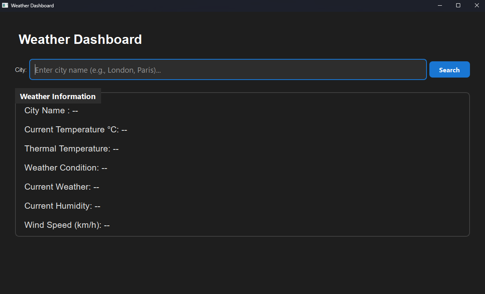

# Weather Dashboard

Weather Dashboard in realtime with PySide6.

## Setup
```bash
# Install dependencies 
pip install -r requirements.txt

# Configure API key
cp .env.example .env
# Add your OpenWeatherMap key

# Run
python src/main.py
```

### OpenWeather API Configuration
in .env
```
API_KEY=your_api_key_here
```
#### Get your free API key at: https://openweathermap.org/api_keys, creating an account is necessary

## Stack

- Python 3.10+
- PySide6 6.10
- OpenWeather API

## File Structure
```
src/
├── main.py           # Entry point
├── ui/               # Interface
│   ├── main_window.py
│   ├── widgets/      # Components
│   └── styles.qss    # Styles
├── services/         # API Logic
└── utils/          
```

## Preview

